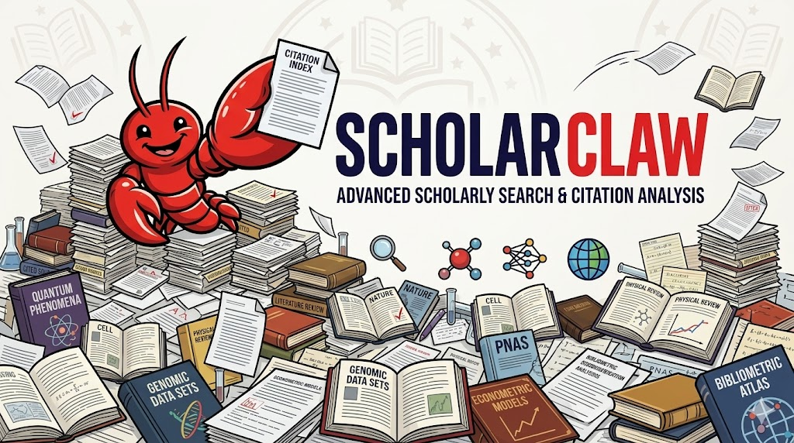

# ScholarClaw - LobsterAI 学术搜索技能

<div align="center">
  

  [**在线体验 →**](https://scholarclaw.youdao.com/)

  [English](README.md) · 中文
</div>

---

**ScholarClaw** 是 LobsterAI/OpenClaw 的综合性学术搜索技能，提供跨多个学术数据库的智能搜索、引用追踪、论文博客生成和 SOTA 榜单分析功能。

由 **网易有道** 打造，与 LobsterAI 智能体框架无缝集成，帮助研究人员和学生发现、分析和理解学术文献。

## 核心功能

- **统一搜索** — 搜索 ArXiv、PubMed、OpenAlex、NeurIPS、CVF 等多个平台
- **学术搜索** — AI 驱动的学术搜索，支持查询分析和重排序
- **引用分析** — 追踪引用并发现相关工作
- **博客生成** — 从学术论文生成博客文章
- **SOTA 问答** — 通过自然语言查询 Benchmark/SOTA 结果
- **内容推荐** — 获取热门论文和 GitHub 仓库

## 使用场景

| 触发短语 | 示例 |
|----------|------|
| 学术搜索 | "在 ArXiv 上搜索关于 transformer 的论文" |
| SOTA/榜单 | "MMLU benchmark 的 SOTA 是多少？" |
| 引用查询 | "谁引用了这篇论文？" |
| 论文分析 | "从这篇论文生成一篇博客" |
| 内容推荐 | "给我看看热门的 ML 论文" |

## 快速开始

### 前置要求

- 已安装 LobsterAI 或 OpenClaw
- Node.js 16+（用于 TypeScript 客户端）
- curl 和 jq（用于 Shell 脚本）

### 安装

**方式一：自然语言安装（推荐）**

```
"从 https://github.com/netease-youdao/scholarclaw 安装技能"
```

**方式二：手动安装**

```bash
# 克隆仓库
git clone https://github.com/netease-youdao/scholarclaw.git

# 复制技能到 LobsterAI 技能目录
cp -r scholarclaw /path/to/lobsterai/SKILLs/
```

### 配置

```yaml
# 在 LobsterAI 的 config.yaml 中
skills:
  - name: scholarclaw
    enabled: true
    config:
      serverUrl: "https://scholarclaw.youdao.com"
      apiKey: "your-api-key"  # 可选，前往 https://scholarclaw.youdao.com/ 申请
```

或通过环境变量：

```bash
export SCHOLARCLAW_SERVER_URL="https://scholarclaw.youdao.com"
export SCHOLARCLAW_API_KEY="your-api-key"  # 可选，前往 https://scholarclaw.youdao.com/ 申请
```

## 使用示例

### 搜索论文

```bash
# 搜索 ArXiv
./scripts/search.sh -q "transformer attention" -e arxiv -l 20

# AI 模式学术搜索
./scripts/scholar.sh -q "多模态学习的最新进展是什么？"
```

### 引用分析

```bash
# 获取引用统计
./scripts/citations_stats.sh -i 1706.03762

# 获取引用列表
./scripts/citations.sh -i 1706.03762 -p 1 -ps 20
```

### 博客生成

```bash
# 从论文生成博客
./scripts/blog_submit.sh -i 2303.14535

# 查看状态和获取结果
./scripts/blog_status.sh -i blog_xxxxxxxxxxxx
./scripts/blog_result.sh -i blog_xxxxxxxxxxxx -o blog.md
```

### SOTA 问答

```bash
# 查询 benchmark
./scripts/benchmark_chat.sh -m "MMLU benchmark 的 SOTA 是多少？"

# 流式模式（适用于长回复）
./scripts/benchmark_chat.sh -m "对比 GPT-4 和 Claude 在各项 benchmark 上的表现" -s
```

## 支持的搜索引擎

| 引擎 | 描述 |
|------|------|
| `arxiv` | ArXiv 预印本服务器 |
| `pubmed` | PubMed 生物医学文献 |
| `google` | Google 搜索（通过 SerpDev） |
| `kuake` | 夸克搜索（中文） |
| `bocha` | Bocha AI 搜索 |
| `nips` | NeurIPS 论文 |
| `thecvf` | CVF/CVPR 论文 |
| `mlr_press` | MLR Press 论文 |
| `openalex` | OpenAlex 学术数据库 |

## API 参考

### 搜索接口

| 接口 | 方法 | 描述 |
|------|------|------|
| `/search` | GET | 跨引擎统一搜索 |
| `/scholar/search` | POST | AI 驱动的学术搜索 |

### 引用接口

| 接口 | 方法 | 描述 |
|------|------|------|
| `/citations` | GET | 获取引用论文列表 |
| `/citations/stats` | GET | 引用统计 |
| `/openalex/cited_by` | GET | OpenAlex 引用查询 |

### 内容生成

| 接口 | 方法 | 描述 |
|------|------|------|
| `/api/blog/submit` | POST | 提交博客生成任务 |
| `/api/blog/result/{id}` | GET | 获取博客结果 |

### SOTA 问答

| 接口 | 方法 | 描述 |
|------|------|------|
| `/api/benchmark/chat` | POST | SOTA 问答 |
| `/api/benchmark/chat/stream` | POST | SOTA 问答（流式） |

## 配置

### 环境变量

| 变量 | 默认值 | 描述 |
|------|--------|------|
| `SCHOLARCLAW_SERVER_URL` | `https://scholarclaw.youdao.com` | API 服务器地址 |
| `SCHOLARCLAW_API_KEY` | - | API Key（可选，前往 https://scholarclaw.youdao.com/ 申请） |
| `SCHOLARCLAW_DEBUG` | `false` | 启用调试日志 |

### 配置优先级

1. 代码中的显式配置
2. 环境变量
3. LobsterAI 技能配置
4. 默认值

## 技术栈

| 组件 | 技术 |
|------|------|
| 语言 | TypeScript |
| 运行时 | Node.js 16+ |
| HTTP | fetch API |
| 配置 | YAML / 环境变量 |

## 目录结构

```
scholarclaw/
├── server/                 # TypeScript 客户端
│   ├── index.ts           # 主入口
│   ├── client.ts          # HTTP 客户端
│   ├── config.ts          # 配置
│   └── types.ts           # 类型定义
├── scripts/               # Shell 脚本
│   ├── search.sh          # 统一搜索
│   ├── scholar.sh         # 学术搜索
│   ├── citations.sh       # 引用查询
│   ├── blog_submit.sh     # 博客生成
│   └── ...
├── examples/              # 使用示例
├── SKILL.md               # 技能定义
├── README.md              # 英文文档
└── README_CN.md           # 中文文档
```

## 联系我们

- **邮箱**：scholarclaw@rd.netease.com
- **微信群**：扫描下方二维码加入 ScholarClaw 交流群

<div align="center">
  
</div>

## 许可证

MIT License

---

由 **网易有道** 构建和维护。
