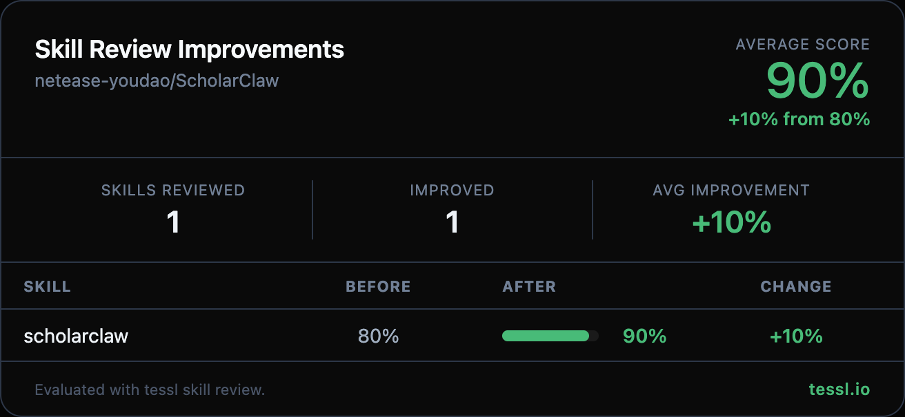

Hey @linhuifj 👋

I ran your skills through `tessl skill review` at work and found some targeted improvements. Here's the full before/after:

| Skill | Before | After | Change |
|-------|--------|-------|--------|
| scholarclaw | 80% | 90% | +10% |

Changes summary

**Trigger section consolidation** — The original "When to Use This Skill" section had 6+ overlapping subsections (Primary Triggers, Automatic Trigger Keywords, Academic Paper Search, SOTA/Benchmark Queries, Citation Analysis, Paper Analysis & Blog Generation, Research Recommendations, Key Trigger Phrases) that all conveyed the same routing information. Consolidated into a single concise list covering all trigger scenarios without repetition.

**API Reference compaction** — Replaced verbose per-endpoint parameter tables and inline JSON examples with a compact summary table listing all 11 endpoints, their methods, key parameters, and descriptions. Links to `examples/` for full response schemas and detailed parameter documentation.

**Response Formats & Error Handling deduplication** — Removed the standalone Response Formats and bottom Error Handling sections, which duplicated information already covered in the Best Practices section and the `examples/` directory.

**Configuration trim** — Removed the full JSON config file and OpenClaw YAML examples, keeping only the environment variable approach (the most common method) with a link to the README for alternative configuration methods.

**Frontmatter format fix** — Changed the description field from YAML block scalar (`|`) to a quoted string for standard formatting.

Honest disclosure — I work at @tesslio where we build tooling around skills like these. Not a pitch - just saw room for improvement and wanted to contribute.

Want to self-improve your skills? Just point your agent (Claude Code, Codex, etc.) at [this Tessl guide](https://docs.tessl.io/evaluate/optimize-a-skill-using-best-practices) and ask it to optimize your skill. Ping me - [@yogesh-tessl](https://github.com/yogesh-tessl) - if you hit any snags.

Thanks in advance 🙏
